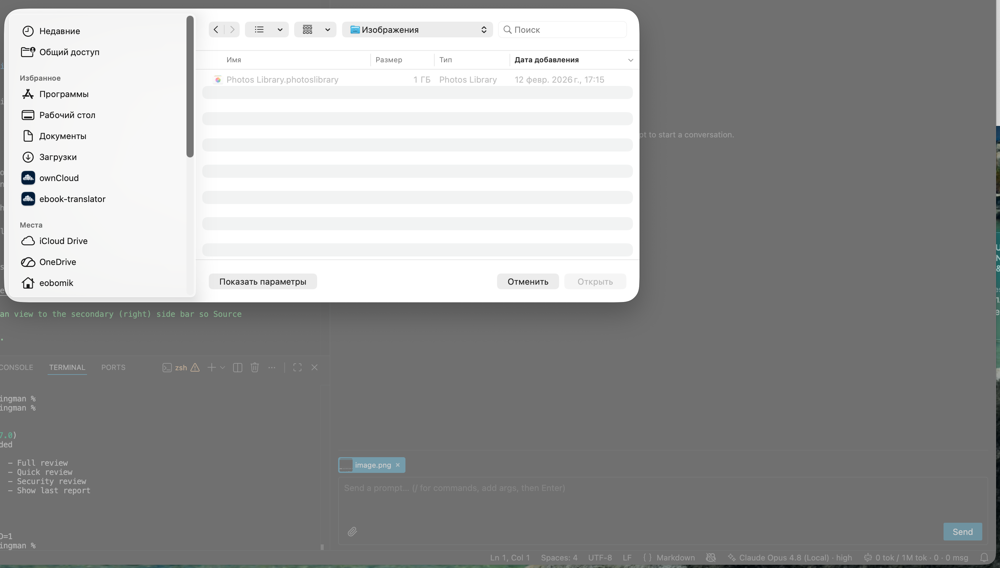

<!-- sources: README.md, webview-ui/src/components/AssistantBlock.tsx, webview-ui/src/components/ToolCard.tsx, webview-ui/src/components/Composer.tsx, webview-ui/src/components/CopyButton.tsx -->

# Chat & tool cards

## What it is / when to use it

The chat panel is where you talk to the agent. You type a prompt, and pi's reply streams in
as it's generated — both the assistant's text and its thinking. Everything renders as
markdown, with code blocks, so responses are easy to read.

When the agent runs a tool (reading a file, running a command, editing code), that call
appears as its own collapsible card in the transcript. You can expand a card to see the live
output and copy the exact source text with a copy button — you get clean text, not a screen
scrape. This is the main surface you'll use in Wingman.

## How to use it

1. Open the Sqowe Wingman panel from the activity bar and focus the Chat view.
2. Type a prompt in the composer.
3. Press Enter to send, or Shift+Enter to add a newline. The composer grows as you type.
4. Watch the reply stream in. Expand any tool card to see what the agent did.
5. To stop the agent mid-turn, use the stop control while it's working.
6. Use a code block's copy button to grab source text without the surrounding chrome.

You can also attach images to a prompt when the model supports them — see
.

## Commands & settings

| Command | How to run |
| --- | --- |
| Focus Chat | Command Palette → Sqowe Wingman: Focus Chat |

---
[← All docs](../index.md)
