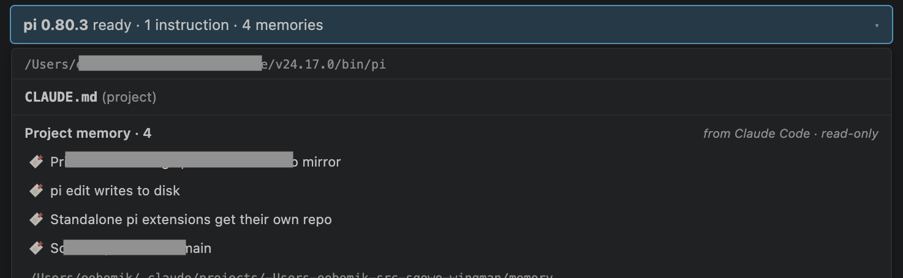

<!-- sources: CHANGELOG.md#0.1.10, CHANGELOG.md#0.2.0, docs/design/claude-memory-sharing.md, pi-extensions/claude-memory/README.md, pi-extensions/claude-memory/index.js, src/extension.ts, src/ui-protocol/bridge.ts, src/webview/provider.ts, src/shared/path-guard.ts, src/shared/messages.ts, webview-ui/src/App.tsx, contributes:shareClaudeMemory, docs/chats/duplicate-instruction-file-tooltip-issue-2026-07-10.md -->

# Claude Code memory sharing

## What it is / when to use it

If you work on a project with both Claude Code and pi, Claude Code keeps a running
memory of facts it has learned about that project — conventions you follow, decisions
you've made, gotchas it's hit. pi normally knows nothing about that. Wingman bridges the
gap: when a project also has a Claude Code memory folder, Wingman shares those facts with
the pi agent so switching tools doesn't lose the context.

The sharing is strictly **one-way and read-only**. Wingman reads Claude Code's memory and
hands it to pi; it never writes, updates, or deletes anything in that folder. Claude Code
stays the sole owner of its memory. The facts are given to the agent as point-in-time
notes with an instruction not to edit them.

Use it when you bounce between Claude Code and pi on the same repo and want pi to start
each session already aware of what Claude Code has recorded.

## How it works

The memory is injected into pi's system prompt at the start of a session and surfaced in
the Chat view's status banner:

1. When pi starts (or restarts), Wingman looks for Claude Code's memory folder for the
   current project.
2. If it finds one, it reads the memory index plus the individual fact files and appends
   them to pi's system prompt under a *Project memory (shared from Claude Code —
   read-only)* heading.
3. The status banner shows a `· N memories` count next to the pi-ready line.
4. Click the banner to open the popover — a read-only **Project memory** group lists each
   fact with a `from Claude Code · read-only` badge.

The injected block is resolved once per session and appended identically on every turn, so
the shared context stays stable while you chat. Editing an instruction or memory file
takes effect after a [Reload pi Agent](reload-agent.md), which re-reads the folder.

## Reading the popover

The Project memory group appears below the instruction-files list in the banner popover:

- **A header** — `Project memory · N` with the `from Claude Code · read-only` badge, so
  it's always clear these facts come from Claude Code and pi won't change them.
- **Up to 8 rows** — each fact shows a bookmark icon and its title. Click a row to open
  that memory file in the editor.
- **A `+N more` row** — if there are more than 8 facts, this row opens the whole memory
  folder so you can browse everything.
- **The folder path** — click it to reveal the memory folder in your OS file browser.

The 8-row cap keeps the popover a predictable size no matter how much memory a project has
accumulated; the count in the banner tells you the true total.

## Where the memory comes from

Claude Code stores per-project memory under your home directory at
`~/.claude/projects/<project>/memory/`, with an index file and one file per fact. Wingman
derives the project's folder from the directory pi is running in (falling back to your git
repository root, so launching pi from a subfolder still resolves correctly).

If a project has no such folder — the normal case for a repo you only ever use with pi —
the feature is simply inactive: no memory is injected and the banner shows no memory count.

## Turning it off and tuning it

The simplest switch is the **`sqoweWingman.shareClaudeMemory`** setting (default on). Find it
in VS Code under Settings → search "Sqowe Wingman", or see [Settings](../reference/settings.md).
Toggle it off to stop sharing memory entirely; Wingman reloads the agent to apply and clears
the Project memory banner group. Toggle it back on to resume.

For finer control there are two environment variables, read inside the pi agent process. Set
them in the environment VS Code launches with (for example your shell profile):

| Variable | Values | Default | What it does |
| --- | --- | --- | --- |
| `WINGMAN_CLAUDE_MEMORY` | `off` | unset (on) | Set to `off` to disable memory sharing entirely — a lower-level override that complements the `sqoweWingman.shareClaudeMemory` setting. |
| `WINGMAN_CLAUDE_MEMORY_MAX_CHARS` | integer | `12000` | How many characters of memory to inline into the prompt. Whole fact files are included until the budget is reached; the rest are listed by name for the agent to read on demand. |

The character budget only bounds what goes into the prompt. The banner popover always lists
every fact (so any of them is clickable), independent of how much was inlined.

---
[← All docs](../index.md)
