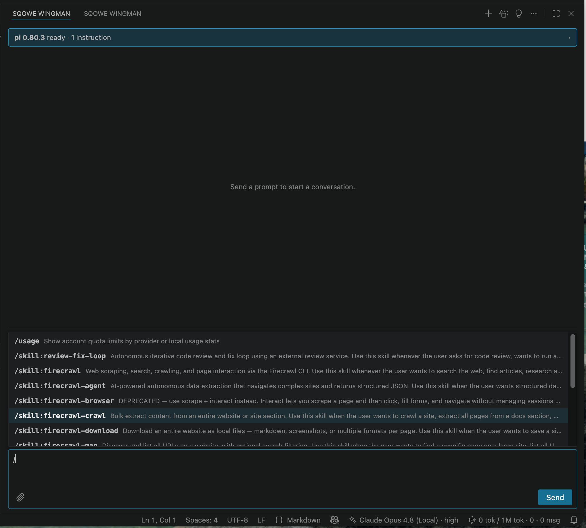

<!-- sources: README.md, src/commands/, docs/chats/implementing-slash-commands-and-native-vs-code-integrations-2026-06-23.md, docs/chats/wingman-slash-command-behavior-change-investigation-2026-07-03.md, contributes.commands -->

# Commands

## What it is / when to use it

pi ships two kinds of commands, and Wingman surfaces both so you don't have to leave the
editor.

**Slash commands** are pi's user commands, skills, and prompt templates. Type `/` in the
composer and an autocomplete menu shows what's available. This is how you reach the things
pi lets you extend it with.

**Native commands** are pi's built-ins — set model, set thinking level, compact, fork, clone,
export — surfaced as real VS Code commands. You can run them from the Command Palette, from
the chat view's toolbar and `⋯` menu, or (for a few) from the status bar. They drive the
*running* pi session over RPC, which is convenient for the current conversation. Persistent
defaults still come from pi's configuration.

## How to use it

Slash commands:

1. Type `/` in the composer to open the autocomplete menu.
2. Pick an entry (or keep typing to filter). Selecting one inserts `/name ` and parks the
   cursor after it — so you can type arguments or free-text instructions before you send.
   Templates that declare an argument hint show it in the dropdown (e.g. `<PR-URL>`).
3. Press Enter to send.

Native commands:

- Command Palette → type "Sqowe Wingman" to see them all.
- Chat view toolbar and `⋯` menu — Set Model, Set Thinking Level, and the session actions
  (Compact, Fork, Clone, Export) live here.
- New Session has a keybinding: Cmd+Alt+N (Ctrl+Alt+N on Windows/Linux) while the Chat view
  is focused.

## Commands & settings

| Command | How to run |
| --- | --- |
| New Session | Command Palette → Sqowe Wingman: New Session (`Cmd+Alt+N` / `Ctrl+Alt+N` when Chat is focused) |
| Set Model | Command Palette or Chat toolbar → Set Model |
| Cycle Model | Command Palette → Sqowe Wingman: Cycle Model |
| Set Thinking Level | Command Palette or Chat toolbar → Set Thinking Level |
| Cycle Thinking Level | Command Palette → Sqowe Wingman: Cycle Thinking Level |
| Compact Session | Command Palette or Chat `⋯` menu → Compact Session |
| Fork Session | Command Palette or Chat `⋯` menu → Fork Session |
| Clone Session | Command Palette or Chat `⋯` menu → Clone Session |
| Export Session as HTML | Command Palette or Chat `⋯` menu → Export Session as HTML |

Related: [Sessions](sessions.md), [Session stats](session-stats.md),
[Reload pi Agent](reload-agent.md).

---
[← All docs](../index.md)
