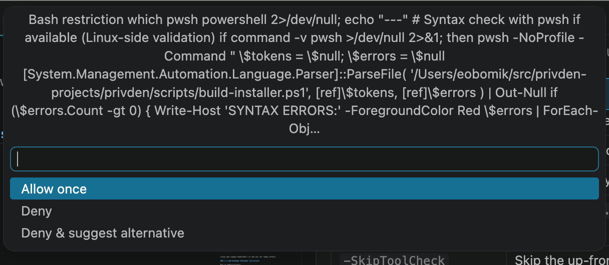

<!-- sources: README.md, src/ui-protocol/bridge.ts, docs/chats/phase-6-vs-code-ui-for-ai-agent-interactions-2026-06-23.md, docs/chats/vscode-extension-ui-placement-decision-for-code-agents-2026-06-22.md -->

# Native dialogs

## What it is / when to use it

pi sometimes needs to ask you something mid-turn — permission to run a command, a choice
between options, or a free-text input. In the terminal these are keyboard-driven selectors.
In Wingman they render as native VS Code UI instead: quick-picks, modal dialogs, and input
boxes. That means the prompts look and behave like the rest of your editor, and you answer
them with the mouse or keyboard the same way you would any VS Code dialog.

There's nothing to configure. When the agent needs an answer, the dialog appears; your reply
goes straight back to pi and the turn continues.

## How to use it

1. While the agent works, watch for a VS Code quick-pick, modal, or input box to appear.
2. Answer it — pick an option, confirm/deny, or type your input.
3. The agent continues with your response.

---
[← All docs](../index.md)
