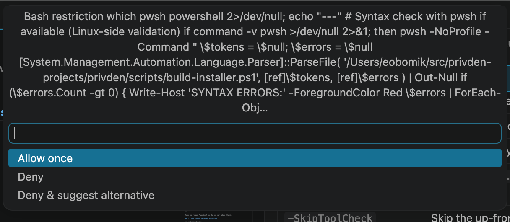

<!-- sources: README.md, src/ui-protocol/bridge.ts, src/shared/dialog-options.ts, webview-ui/src/components/QuestionCard.tsx, package.json#contributes, docs/design/in-chat-question-cards.md -->

# Questions and dialogs

## What it is / when to use it

The agent sometimes needs to ask you something mid-turn — permission to run a command, a
choice between approaches, or a free-text answer. In the terminal these are keyboard-driven
selectors. Wingman shows them in whichever surface suits the question:

- **Short prompts** — *Allow once / Deny*, yes-or-no confirmations, a one-line input — appear
  as native VS Code quick-picks, modals, and input boxes. You answer them with a keystroke.
- **Real questions** — several options, each with a sentence or two explaining it, sometimes a
  code preview — appear as a **card in the conversation**, where the whole question is readable.

There is nothing to configure. When the agent needs an answer, it appears; your reply goes
straight back and the turn continues.

## Answering a question card

A card looks like part of the conversation, because it is — it appears at the end of the
transcript and stays there afterwards.

1. Read the question. It wraps like any other text, however long it is.
2. Read the options. Each one shows its short label and the full explanation beneath it.
3. If an option has a **Show preview** link, click it to see the code or mockup for that
   choice, expanded in place.
4. Click the option you want. That answers immediately — there is no separate confirm step.

For a **multiple-choice** question you get checkboxes instead: tick as many as apply, then
press **Submit**. Submitting with nothing ticked is a valid answer — it tells the agent none
of the options apply.

Every open question also has a **Dismiss** button. Dismissing declines the question, and
extensions generally treat that as cancelling the whole set of questions they were asking —
the same as pressing Escape on a quick-pick.

### After you answer

The card collapses into a record of what happened: the question stays visible, your answer is
marked with a tick, and the options you did not pick move behind **Show all options**. It
stays in the transcript so you can scroll back and see what was asked and what you chose.

A card can also close on its own, marked *Expired*, if the question timed out, the session was
replaced, or the agent stopped. Nothing is sent in that case.

## Why some questions are cards and others are not

A VS Code quick-pick row cannot wrap. It is one line, clipped with an ellipsis at a fixed
width, which is fine for *Allow once* but useless for an option whose explanation is the part
you need in order to choose. Multiple choice was worse: the options were squeezed into a
single-line title that ran them together, and you were asked to type numbers for a list you
could not read.

So Wingman looks at the question itself. If the options carry explanations, or are simply too
long for a quick-pick row, it becomes a card. Otherwise it stays native, because a quick-pick
is genuinely faster for a short choice — the permission prompt you see most often is answered
in one keystroke, and moving it into the chat would only slow you down.

This is decided from the shape of the question, not from which extension sent it, so any
extension that writes options this way benefits without changing anything.

## Choosing the surface yourself

If you would rather always get one or the other, set `sqoweWingman.dialogStyle`:

| Value | Behaviour |
| --- | --- |
| `auto` *(default)* | Card when a quick-pick would clip the options, native otherwise. |
| `quickPick` | Always native. Long explanations stay clipped. |
| `chat` | Always a card, including short prompts. |

The setting applies to the next question asked — one already on screen is unaffected.

`chat` is worth knowing about for one specific annoyance: a native quick-pick collapses the
line breaks in its own title, so a permission prompt that wants to show you a long shell
command runs the command together with the heading. A card shows it in full.

---
[← All docs](../index.md)
