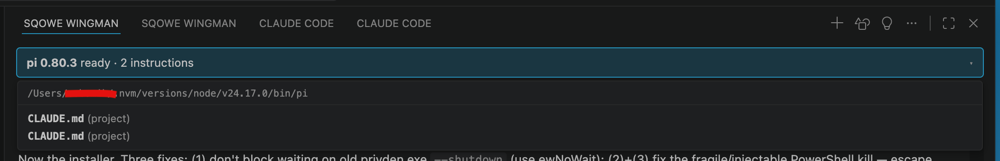

<!-- sources: README.md, docs/design/instruction-files.md, pi-extensions/instruction-report/, src/webview/provider.ts, src/agent/controller.ts, webview-ui/src/App.tsx, docs/chats/implementing-instruction-file-reporting-feature-2026-07-02.md, pi:dist/core/resource-loader.js, pi:docs/usage.md, pi:docs/security.md -->

# Instruction file visibility

## What it is / when to use it

Unlike a single fixed instructions file, pi can load several instruction files at once — some
that inject context (like `AGENTS.md` / `CLAUDE.md`) and some that override or append to the
system prompt (`SYSTEM.md` / `APPEND_SYSTEM.md`), from both global and project scopes. It's
easy to lose track of which ones are actually shaping the current session.

Wingman surfaces this in the status banner. It shows how many instruction files pi loaded for
the session, and opens a popover listing each file with its scope and role — for example
`AGENTS.md (global)` or `CLAUDE.md (project)`. This is ground truth: the data comes from pi
itself, through a small bundled pi extension, not a filesystem guess. Use it when you want to
confirm what rules the agent is operating under.

## How to use it

1. Look at the status banner in the Chat view — it shows the count of loaded instruction
   files for the session.
2. Click it to open the popover and see each file with its scope (global / project) and role.
3. Hover any filename in the popover to see its full path.

If you edit an instruction file, use [Reload pi Agent](reload-agent.md) to have pi re-read it.

## Where instruction files come from

There are two kinds, and they are found in completely different ways.

### Context files — `AGENTS.md` and `CLAUDE.md`

Context files are **additive**: their full text is appended to the agent's system prompt. pi
looks for them in two places.

**The global file.** pi checks your agent directory — `~/.pi/agent/` by default, or whatever
`AGENT_DIR` points at if you've set it.

**Every directory from your project up to the filesystem root.** This is the part that
surprises people. pi starts at the folder the agent is running in, checks it for a context
file, then checks its parent, then *that* parent, and so on — all the way to `/`. It does not
stop at your repository root, and it does not stop at your home directory.

In each directory pi takes **at most one** file. It tries these four names in order and stops
at the first one that exists:

| Order | Filename |
| --- | --- |
| 1 | `AGENTS.md` |
| 2 | `AGENTS.MD` |
| 3 | `CLAUDE.md` |
| 4 | `CLAUDE.MD` |

So a folder holding both an `AGENTS.md` and a `CLAUDE.md` contributes only the `AGENTS.md` —
the `CLAUDE.md` is silently skipped. If the same file would somehow be found twice, it is
only loaded once.

This walk-up-to-the-root design exists for monorepos: shared conventions live at the repo
root, package-specific rules live in each subdirectory, and the agent gets both.

### How they're concatenated

All the files found are joined into one block, in this order:

1. The global file from `~/.pi/agent/`, if there is one.
2. The outermost ancestor directory's file.
3. …each subsequent directory on the way down…
4. Your project folder's own file, **last**.

Your project's own instructions land closest to the end, which is generally where the most
specific rules belong.

Context files are loaded **regardless of whether you've trusted the project**. Declining the
[trust prompt](trust.md) skips a project's `.pi/` resources, but it does not stop `AGENTS.md`
or `CLAUDE.md` from being read.

### System-prompt files — `SYSTEM.md` and `APPEND_SYSTEM.md`

These behave differently. `SYSTEM.md` **replaces** the default system prompt; `APPEND_SYSTEM.md`
is **appended** to it. There is no directory walk — pi checks exactly two locations and uses
the first match:

1. `.pi/SYSTEM.md` in your project folder — **only if you have trusted the project**.
2. `~/.pi/agent/SYSTEM.md` — the global fallback.

The same two-step applies to `APPEND_SYSTEM.md`. In the popover these are annotated
`(project, replaces default)` or `(global, appended)` so you can tell them apart at a glance.

If the system prompt was set another way — for instance by launching pi with a `--system-prompt`
flag or a prompt template — there is no file to point at, and the popover shows
`custom prompt (CLI flag, replaces default)`.

## Reading the popover without being misled

Two labelling quirks are worth knowing.

**"project" really means "not global."** Wingman marks a file `global` only when it lives inside
`~/.pi/agent/`. Everything else is labelled `project` — including context files picked up from
directories *above* your project. A `CLAUDE.md` two levels up in some parent folder still shows
as `(project)`.

**Two rows can look identical.** The popover shows each file's name and scope, not its path. If
the walk finds context files with the same name in different directories, you'll see the same
label twice — for example two rows both reading `CLAUDE.md (project)`. They are genuinely two
different files, not a duplicate. **Hover either row to see its full path** and tell them apart.

If the count in the banner is higher than you expected, this is almost always why: a context
file is sitting in a parent directory you weren't thinking about. Open the popover and hover
each entry to find it.

## Stopping a file from being loaded

Wingman always lets pi discover context files; there is no setting to turn this off, and no way
to exclude one directory from the walk. (The pi command line has a `--no-context-files` flag,
but it disables discovery entirely — including your project's own file — and Wingman does not
pass it.)

If a parent directory's context file is being picked up and you don't want it, **rename it** to
something outside pi's four candidate names — `NOTES.md`, say. Then use
[Reload pi Agent](reload-agent.md) and confirm the count in the banner has dropped.

---
[← All docs](../index.md)
