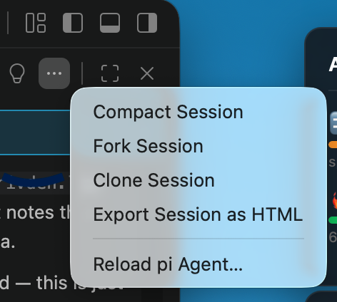
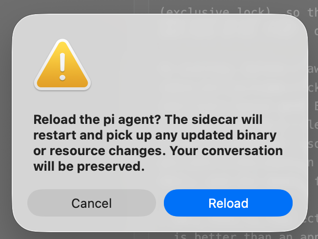

<!-- sources: README.md, docs/design/reload-pi-agent.md, src/commands/reload.ts, docs/chats/implementing-agent-reload-feature-with-test-fixes-2026-07-01.md, contributes.commands[reloadAgent] -->

# Reload pi Agent

## What it is / when to use it

The agent runs as a pi sidecar process that Wingman starts when you open a workspace. Two
things need a restart to take effect:

- **Config changes** — you edited something in `~/.pi/agent/` or the project `.pi/`
  (extensions, skills, prompt templates, keybindings, `SYSTEM.md` / context files, settings)
  and want pi to re-read it. This mirrors pi's interactive `/reload`.
- **A new pi binary** — you updated or reinstalled pi (`npm i -g`, an nvm switch, a new
  install that outranks the old one) and want Wingman to run the new executable.

Reload pi Agent handles both by tearing down and re-spawning the sidecar. It re-resolves the
pi binary on every reload, and it preserves your current conversation by resuming the saved
session file — so you don't lose where you were.

## How to use it

1. Make your change (edit config, or update pi in your system).
2. Run Reload pi Agent — from the Chat view's `⋯` menu, or the Command Palette.
3. Wingman restarts the sidecar and resumes your session; keep chatting.

## Commands & settings

| Command | How to run |
| --- | --- |
| Reload pi Agent… | Command Palette → Sqowe Wingman: Reload pi Agent, or Chat `⋯` menu |

---
[← All docs](../index.md)
